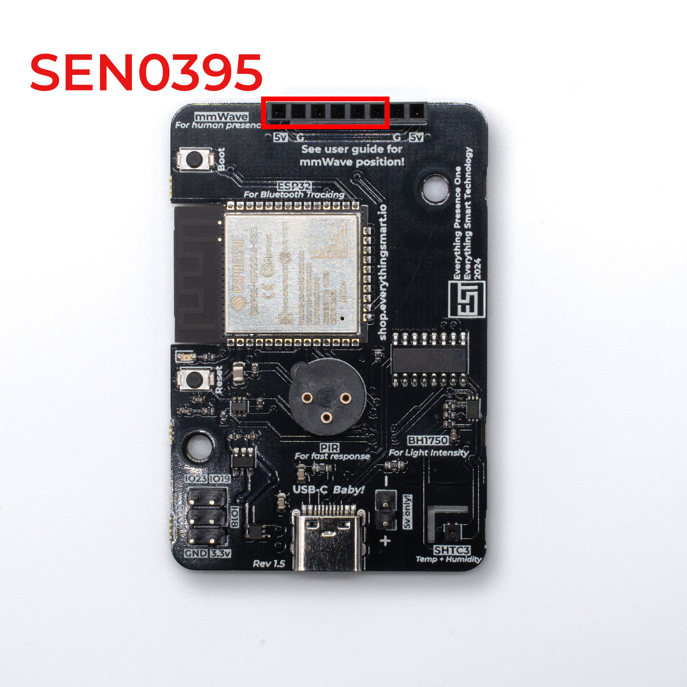

# Assembly

{: .no_toc }

Time to assemble the hardware ready for setup!
{: .fs-6 .fw-300 }

## Case - Part 1

First you are going to want to grab 4 components of the case - the back, ball joint, locking ring and stand.

Insert the ball joint through the back of the case from the front side. Then, while holding the ball joint in place, use the locking ring to tighten in place.

{: .important }
The locking ring has a slight groove on one side - make sure the groove faces the back of the case.

{: .note }
The ball joint will be pretty tight but will still rotate with enough force - this is intentional to allow you to orientate in any position.

Use your thumb to press against the back of the ball joint for support and then push the stand onto the ball joint.

{: .note }
The stand may be quite tight initially due to the 3D printing process, but should loosen up after a few rotations.

## Board and Sensors

Grab the EP1 board, mmWave Sensor and PIR.

The the EP1 board and press it into the back of the case - each corner should click into place. Please note we have removed the stand in the below photos for demo purposes.

Next, take the mmWave sensor and identify which sensor you have - either the SEN0395 (6 Pin) or the SEN0609 (5 Pin).

### Double slot board

If your EP1 board has 2 x 6 pin slots (one horizontal and one vertical), this board is only compatible with the 6 pin SEN0395.

Insert the SEN0395 into one of the two slots:

Slot 1 at the top of the board gives you a wider horizontal field of view with a narrower vertical field of view. Slot 2 at the side of the board gives you a wider vertical field of view with a narrower horizontal field of view. Slot 1 is the recommendation for most people.

### Single 8 Pin slot

If your board has the newer 8 pin slot, this is compatible with **both the SEN0395 and SEN0609.**

If you have the SEN0395 sensor (6 pin), it goes to the far left position. The "V" pin on the mmWave should line up with the 5v on the board:

If you have the SEN0609 (5 pin), it goes to the far right position. The "VIN" pin on the mmWave should line up with the 5v on the board:

{: .warning }
Making sure to line up the 5v pin on the sensor with the correct 5v pin on the board, damage could occur to the sensor from plugging it in to the wrong socket.

{: .warning }
Please take extra care with the mmWave sensor when it's inserted into the slot since the pins will bend easily and could cause damage. Remove the sensor whenever moving or working on it.

Then take PIR sensor and push it into the PIR socket in the middle of the board. The PIR can only fit in the socket in one orientation.

With both sensors and the board installed, it should look like this:

## Case - Part 2

Finally, clip the front of the case on and into position.

The final hardware will look like this:

We can now power on for the first time.
{: .fs-6 .fw-300 }

## Powering On

You will want to grab a USB-C cable and a power brick - any charger should suffice, as power requirements are around 200 milliamps.

The power brick will be used later when moving the EP1 to it's final position, but

Plug the USB-C cable into the EP1 and a red light will illuminate on the front of the device.

## Next Steps

Now we have assembled the hardware, we can update it and connect it to WiFi!

[Updating and connecting to WiFi](http://everythingsmarthome.github.io/everything-presence-one/updating.html){: .btn .btn-blue }

