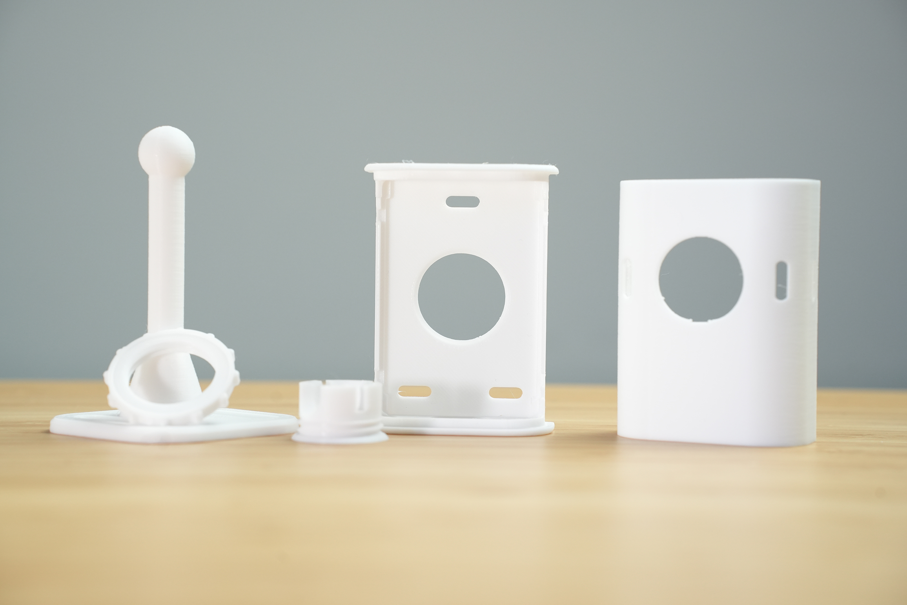
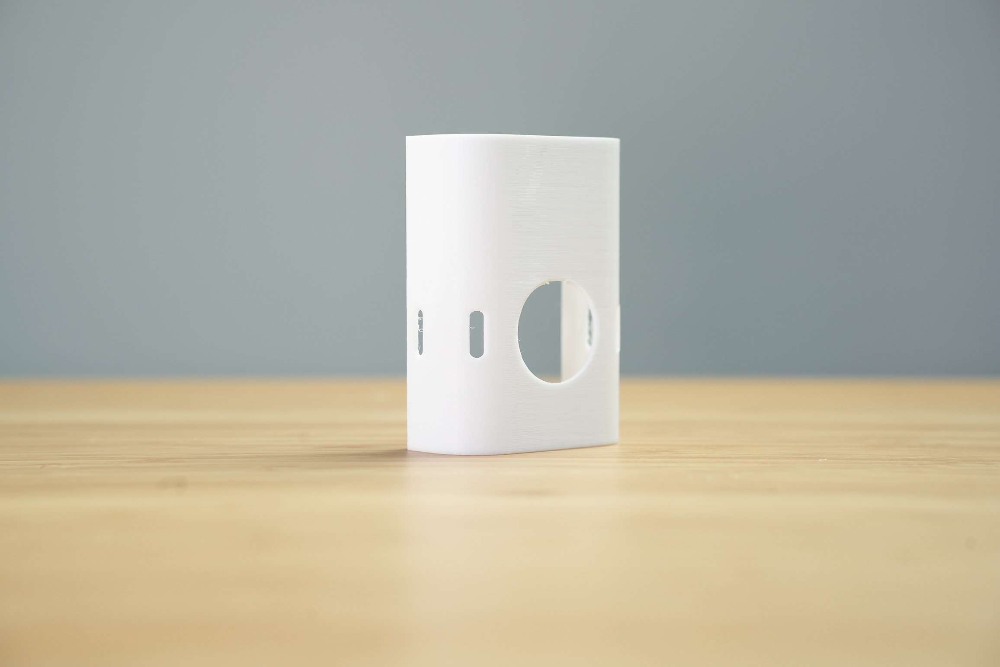
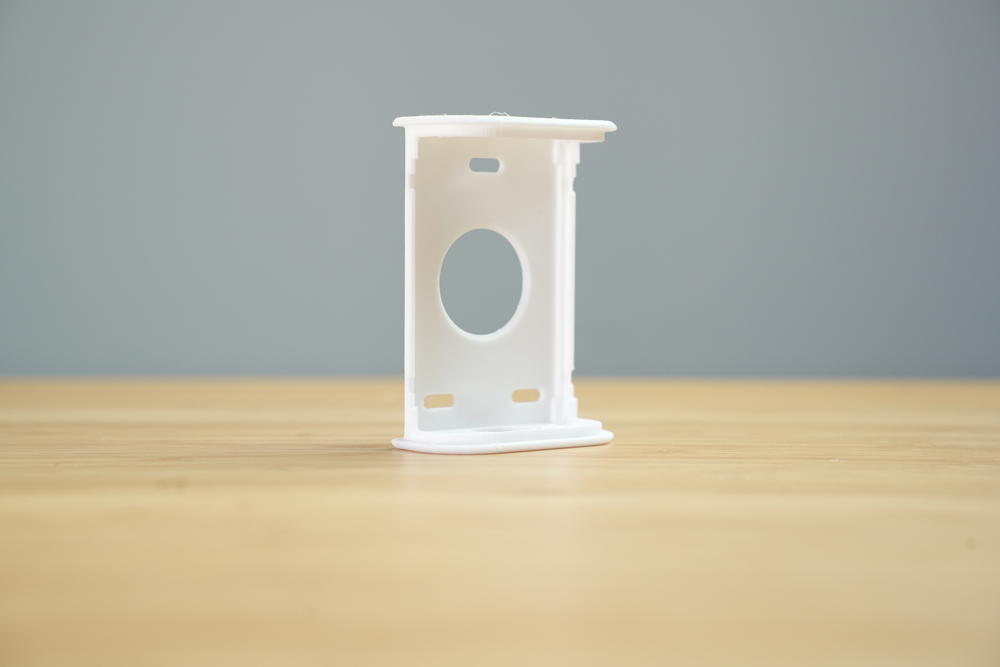
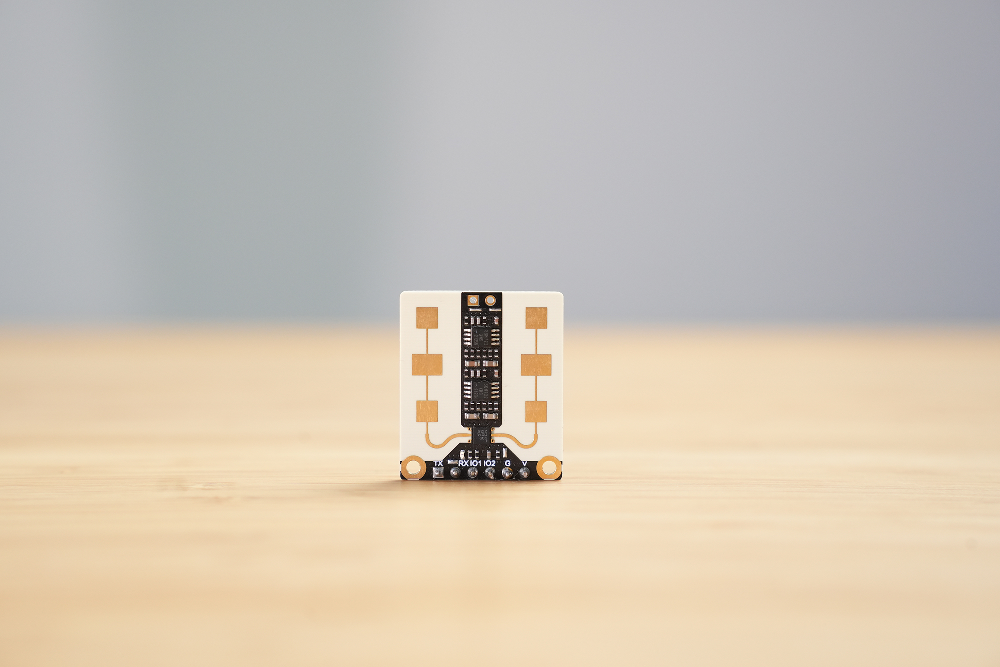

# Hardware Overview

{: .no_toc }

Let's take a look at an overview of the hardware and parts required for setup.
{: .fs-6 .fw-300 }

There are several components that make up the Everything Presence One. You may have received some or all of these components depending which version you purchased - if you purchased the board only then you will need to provide your own mmWave Sensor and PIR sensor for example.

Each component is listed below - please familiarise yourself with each component for this guide.

## Everything Presence One Board

The EP1 board is the main PCB for the device. It's where the ESP32 is located that provides Wi-Fi connectivity and is the brains of all of the sensors.

Each of the main components is labelled directly on the board itself to help with assembly. Directly on the EP1 board we have the following components:
* ESP32-WROOM-32E - 4MB flash version
* BH1750 Light Illuminance sensor
* SHTC3 Temperature and Humidity Sensor
* Header Slot for DFRobot SEN0395 and SEN0609 mmWave Sensor
* Socket for Panasonic EKMC1603111/2/3 PIR Sensor
* USB-C for power and programming
* 5v Header input for optional power
* 4 Additional GPIO pins for expansion

## Official Case

The Official Case for the EP1 is available for purchase [here](https://shop.everythingsmart.io/products/everything-presence-one-official-case) or if you prefer to print your own, the STL is located on [Printables](https://www.printables.com/model/302846-Everything%20Presence%20One%20-%20Official%20Case)

The case has 5 components - Front, Back, Stand, Ball Joint and Locking Ring.

Front:

Back:

Stand:

Ball Joint:

Locking Ring:

## mmWave Sensor

The mmWave comes included as part of the Everything Presence One Full Kit - if you purchased the board only then you will need to supply your own mmWave sensor.

The DFRobot mmWave Sensor SEN0395 and SEN0609 (for newer Rev 1.5 EP1 boards) are the **only** compatible and validated sensor currently - please do not try to use a different sensor as you may cause damage.

## Motion Sensor PIR

The PIR comes included as part of the Everything Presence One Full Kit - if you purchased the board only then you will need to supply your own PIR sensor.

Part numbers for the PIR are one of the following:

* EKMC1603111
* EKMC1603112
* EKMC1603113

The Panasonic EKMC series of sensor is the **only** compatible and validated sensor currently - please do not try to use a different sensor as you may cause damage.

## Next Steps

Now we have familiarised ourselves with the hardware, let's get the hardware assembled and ready to setup!

[Assembly](http://everythingsmarthome.github.io/everything-presence-one/assembly.html){: .btn .btn-blue }

