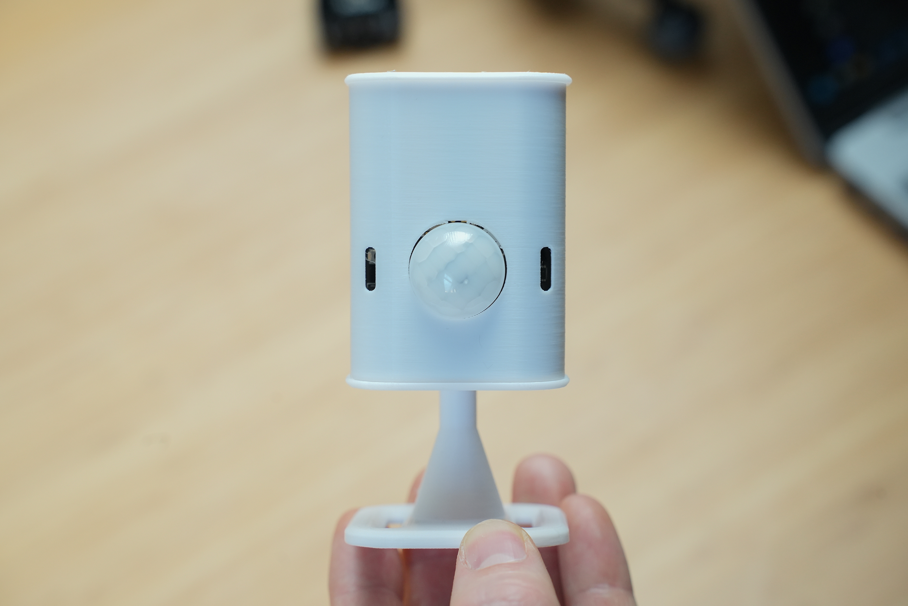

{: .warning-title }
Make sure to update your EP1 to the latest firmware that fixes known issues by [Updating](https://everythingsmarthome.github.io/everything-presence-one/flashing.html){: .btn .btn-blue }

Welcome to the documentation for the Everything Presence One!

This documentation will guide you through the hardware, setup and installation of the EP1 for use with Home Assistant. Each section will be broken out into their own pages, and at the bottom of each page you will find a link to the next step.

Let's get started with the hardware unboxing and preperation first!

[Hardware Overview](http://everythingsmarthome.github.io/everything-presence-one/hardware-overview.html){: .btn .btn-blue }
