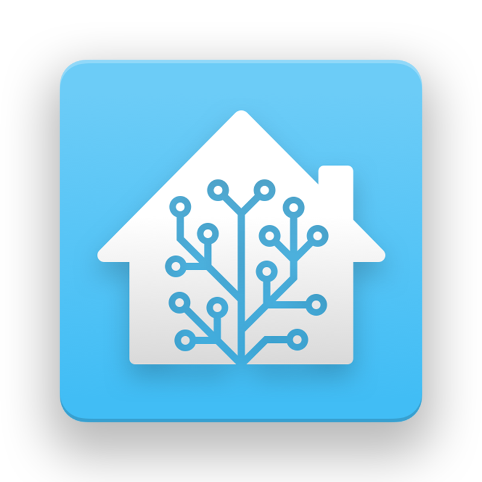

# Updating and Connecting To WiFi

{: .no_toc }

This page will help you to flash and update your Everything Presence One to the latest version!
{: .fs-6 .fw-300 }

## Everything Presence One ESPHome Firmware Install

Here you can install the latest [ESPHome](https://esphome.io) firmware on the Everything Presence One board for direct integration with [Home Assistant](https://home-assistant.io).

Hit the connect button to install the latest ESPHome firmware on you're
Everything Presence One board. No programming or other software
required.

{: .warning-title }
If you do not see a "Connect" button below, use a supported web browser like Google Chrome.

After flashing has completed, you can connect the EP1 to your Wi-Fi and integrate directly with Home Assistant.

  <label>
    <input type="radio" name="type" value="everything-presence-one" checked/>
    
  </label>
  <label>
    <input type="radio" name="type" value="everything-presence-one-st" />
    
  </label>

<esp-web-install-button></esp-web-install-button>

## Next Steps

With the EP1 fully updated and connected to WiFi, the final step is to connect it to Home Assistant!

[Connecting to Home Assistant](http://everythingsmarthome.github.io/everything-presence-one/connecting-home-assistant.html){: .btn .btn-blue }

