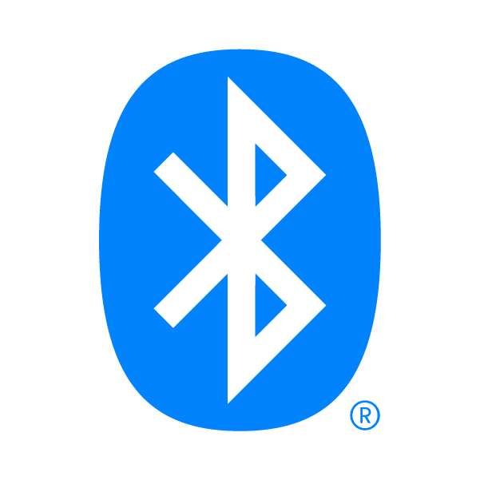
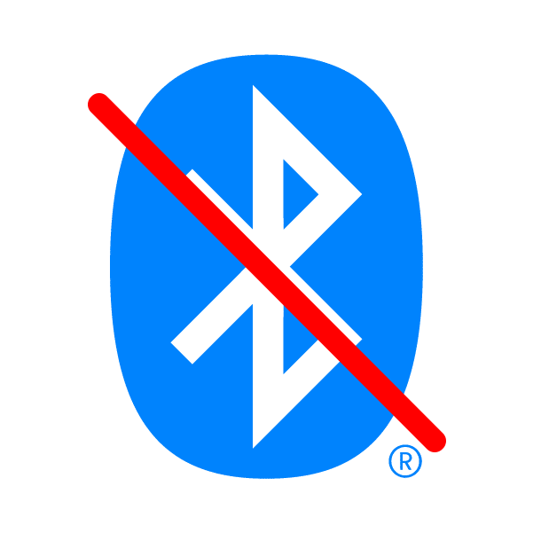

# Updating and Connecting To WiFi

{: .no_toc }

This page will help you to flash and update your Everything Presence One to the latest version!
{: .fs-6 .fw-300 }

## Everything Presence One ESPHome Firmware Install

Here you can install the latest firmware on the Everything Presence One for direct integration with [Home Assistant](https://home-assistant.io) or Samsung Smartthings (Beta).

First, make sure you have the EP1 connected to a USB port on your computer and select the platform you would like to install below. Hit the connect button, select the USB port from the list and then hit the install button to begin installing the latest software on your Everything Presence One.

Once the install has completed, you can then connect the EP1 to your WiFi easily and securely.

{: .warning-title }
If you do not see a "Connect" button below, use a supported web browser like Google Chrome.

{: .warning-title }
After clicking the "Connect" button, if you do not see a "USB Serial" port listed, or you get the error "Failed to open serial port.", you may need to install the CH340 driver. The installer should give you links to the latest driver.

    
Select Smart Home Platform:

    

        <label>
            <input type="radio" name="platform" value="Home Assistant" />
            

                
                

                    
Home Assistant

                    
Choose this for Home Assistant integration, with additional options for Bluetooth.

                

            

        </label>
        <label>
            <input type="radio" name="platform" value="Smartthings" />
            

                
                

                    
SmartThings

                    
Choose this option to integrate with SmartThings

                

            

        </label>
    

    <!-- Sensor Model Options -->
    

        
Select Your mmWave Sensor Model:

        

            <label>
                <input type="radio" name="sensorModel" value="DFRobot SEN0395" />
                

                    
                    

                        
DFRobot SEN0395

                        
Select this option if you are using the DFRobot SEN0395 sensor (6 Pin).

                    

                

            </label>
            <label>
                <input type="radio" name="sensorModel" value="DFRobot SEN0609" />
                

                    
                    

                        
DFRobot SEN0609

                        
Select this option if you are using the DFRobot SEN0609 sensor (5 Pin).

                    

                

            </label>
        

    

    <!-- Add-on Module Options -->
    

        
Select Add-on Module:

        

            <label>
                <input type="radio" name="addonModule" value="No Add-on Module" />
                

                    

                        
No Add-on Module

                        
Proceed without any add-on module.

                    

                

            </label>
            <label>
                <input type="radio" name="addonModule" value="CO2 Module" />
                

                    

                        
CO2 Module

                        
Select this if you are using the CO2 add-on module.

                    

                

            </label>
        

    

    <!-- Board Revision Options -->
    

        
Select Board Revision:

        

            <label>
                <input type="radio" name="boardRevision" value="1.3/1.4" />
                

                    

                        
Revision 1.3/1.4

                        
Select this if your board revision is 1.3 or 1.4.

                    

                

            </label>
            <label>
                <input type="radio" name="boardRevision" value="1.5" />
                

                    

                        
Revision 1.5

                        
Select this if your board revision is 1.5.

                    

                

            </label>
        

    

    <!-- Home Assistant Options -->
    

        
Select Firmware Type:

        

            <label>
                <input type="radio" name="haOption" value="Bluetooth" />
                
                

                    
Bluetooth Proxy

                    
Enable Bluetooth Proxy and Improv. May affect WiFi connectivity.

                

            </label>
            <label>
                <input type="radio" name="haOption" value="No-Bluetooth" />
                
                

                    
No Bluetooth

                    
Choose this option to disable Bluetooth Proxy and Improv, which can improve stability of the WiFi connection and/or you don't need Bluetooth Proxy.

                

            </label>
        

    

    <!-- Firmware Version Options -->
    

        
Select Firmware Version:

        

            <label>
                <input type="radio" name="firmwareVersion" value="Stable" />
                
                

                    
Stable

                    
Choose this for a stable version of the firmware.

                

            </label>
            <label>
                <input type="radio" name="firmwareVersion" value="Beta" />
                
                

                    
Beta

                    
The Beta release includes target tracking and distance zones. Do not use unless you are comfortable with troubleshooting and reporting bugs.

                

            </label>
        

    

    <!-- SmartThings Sensor Options -->
    

        
Select Your mmWave Sensor Model for SmartThings:

        

            <label>
                <input type="radio" name="stSensorModel" value="DFRobot SEN0395" />
                

                    
                    

                        
DFRobot SEN0395

                        
Select this option if you are using the DFRobot SEN0395 sensor for SmartThings.

                    

                

            </label>
            <label>
                <input type="radio" name="stSensorModel" value="DFRobot SEN0609" />
                

                    
                    

                        
DFRobot SEN0609

                        
Select this option if you are using the DFRobot SEN0609 sensor for SmartThings.

                    

                

            </label>
        

    

    <!-- Summary and Install Button -->
    

        <h3>You are flashing:</h3>
        

        

        

        

        

    

    <esp-web-install-button class="hidden"></esp-web-install-button>

## Next Steps

With the EP1 fully updated and connected to WiFi, the final step is to connect it to Home Assistant or Samsung Smartthings (Beta)!

[Connecting to Home Assistant](https://everythingsmarthome.github.io/everything-presence-one/Home%20Assistant/connecting-home-assistant.html){: .btn .btn-blue }
[Connecting to SmartThings](https://everythingsmarthome.github.io/everything-presence-one/SmartThings/smartthings-driver.html){: .btn .btn-blue }

